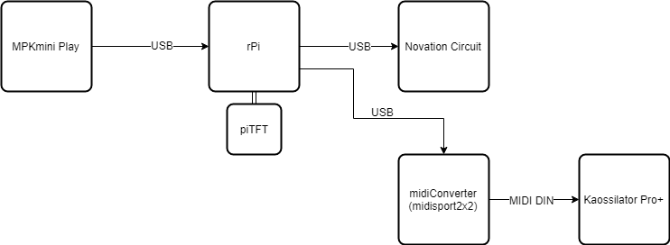

## MIDI usb host

Allows connection between my MPKmini Play with Novation Circuit or Korg's Kaossilator Pro+.

- main platform - rPi2  + TFT with 4 buttons
- all in text mode
- sends notes to Circuit (channel 1 or 2)
- sends notes to Kaossilator, 
  - conversion from note to XY
  - X is taken from note, Y from knob on MPK

Connections diagram:

 

### References

- [MIDI.ino](https://github.com/k-a-r-g/MDMA/blob/master/Firmware/Kommunikator/MIDI.ino)
- [mido](https://mido.readthedocs.io/en/latest/backends/index.html)
- [midihub](https://blokas.io/midihub/)
- [mod-host](https://github.com/BlokasLabs/mod-host)

### Licence 

GNU General Public Licence v3
